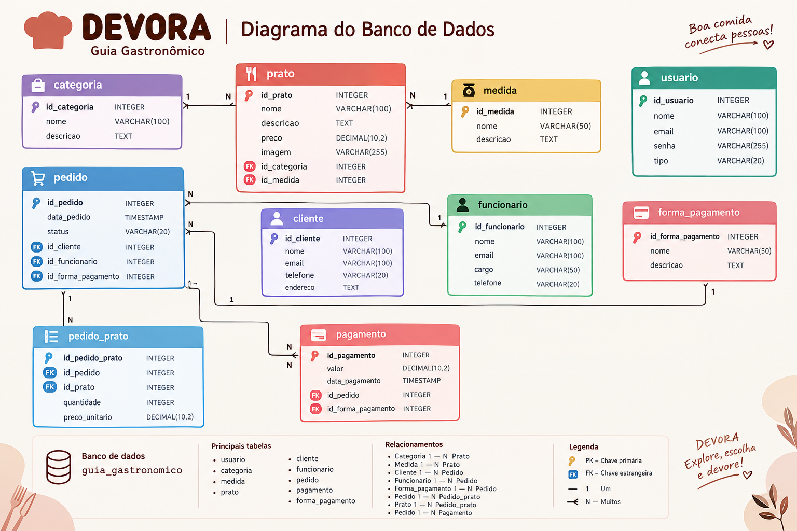

# 🍽️ DEVORA — Guia Gastronômico

<p align="center">
  <strong>Um guia gastronômico para cadastrar, organizar e consultar pratos.</strong>
</p>

---

## 📚 Identificação do projeto

**Projeto:** DEVORA — Guia Gastronômico  
**Disciplina:** Desenvolvimento Web 1 (DW1)  
**Ano:** 2026  
**Aluno:** Maria Eduarda Rodrigues Ferreira  
**Turma:** M32  

---

## 📖 Sobre o projeto

O **DEVORA** é uma aplicação web desenvolvida para a disciplina de **Desenvolvimento Web 1 (DW1)**.

O projeto consiste em um **guia gastronômico**, permitindo o cadastro e a consulta de informações relacionadas a pratos, categorias, medidas e usuários.

A aplicação foi desenvolvida utilizando a arquitetura **Cliente/Servidor**, o padrão **MVC (Model-View-Controller)** e o banco de dados **PostgreSQL**.

---

## 🎯 Objetivo

O objetivo do projeto é desenvolver uma aplicação web funcional que coloque em prática os conteúdos estudados na disciplina, incluindo:

- Arquitetura Cliente/Servidor;
- Padrão MVC;
- Desenvolvimento frontend e backend;
- Criação e utilização de rotas;
- Controllers;
- Operações CRUD;
- Banco de dados PostgreSQL;
- Relacionamentos entre tabelas;
- Chaves primárias e estrangeiras;
- HTML5 semântico;
- CSS;
- JavaScript;
- Git e GitHub.

---

## 🍕 Funcionalidades

O DEVORA possui páginas para gerenciamento das principais informações do sistema.

### 👨‍🍳 Pratos

Permite:

- Cadastrar pratos;
- Consultar pratos;
- Alterar pratos;
- Excluir pratos;
- Informar estoque;
- Informar preço;
- Selecionar medida;
- Selecionar categoria;
- Cadastrar e visualizar imagem do prato.

### 🏷️ Categorias

Permite cadastrar, consultar, alterar e excluir categorias gastronômicas.

Categorias utilizadas no projeto:

- Pizzas;
- Massas;
- Hambúrgueres;
- Porções;
- Salgados;
- Lanches;
- Carnes;
- Acompanhamentos;
- Pratos Executivos;
- Risotos;
- Sobremesas;
- Bebidas.

### 📏 Medidas

O sistema possui cadastro de unidades de medida utilizadas pelos pratos.

Exemplos:

- UN — Unidade;
- KG — Quilograma;
- G — Grama;
- L — Litro;
- ML — Mililitro;
- CX — Caixa;
- PC — Pacote;
- DZ — Dúzia;
- M — Metro;
- FD — Fardo.

### 👤 Usuários

Permite:

- Cadastrar usuários;
- Consultar usuários;
- Alterar usuários;
- Excluir usuários;
- Associar um usuário a Cliente;
- Associar um usuário a Funcionário;
- Consultar o tipo de usuário.

Um usuário pode ser identificado como:

- Cliente;
- Funcionário;
- Cliente e Funcionário.

---

## 🏗️ Arquitetura Cliente/Servidor

O projeto utiliza a arquitetura **Cliente/Servidor**.

### 🖥️ Cliente — Frontend

O frontend é responsável pela interface apresentada ao usuário.

Tecnologias utilizadas:

- HTML5;
- CSS3;
- JavaScript.

O frontend envia requisições para o backend através das rotas da aplicação.

### ⚙️ Servidor — Backend

O backend recebe as requisições do frontend, realiza as operações necessárias e se comunica com o banco de dados.

Tecnologias utilizadas:

- Node.js;
- Express;
- PostgreSQL.

---

## 🧩 Padrão MVC

A aplicação utiliza o padrão **MVC (Model-View-Controller)** para organizar o projeto.

### 📄 View

Representada pelas páginas HTML, CSS e JavaScript do frontend.

Exemplos:

- `menu.html`;
- `prato.html`;
- `categoria.html`;
- `medida.html`;
- `usuario.html`.

### 🛣️ Routes

As Routes recebem as requisições e direcionam cada operação para o Controller correspondente.

Exemplos:

- `pratoRoutes.js`;
- `categoriaRoutes.js`;
- `medidaRoutes.js`;
- `usuarioRoutes.js`;
- `clienteRoutes.js`;
- `funcionarioRoutes.js`.

### 🧠 Controllers

Os Controllers possuem a lógica das operações realizadas no banco de dados.

Exemplos:

- `pratoController.js`;
- `categoriaController.js`;
- `medidaController.js`;
- `usuarioController.js`;
- `clienteController.js`;
- `funcionarioController.js`.

### 🗄️ Banco de dados

A conexão com o PostgreSQL é realizada pelo arquivo:

```text
backend/database.js
```

---

## 📂 Estrutura do projeto

```text
guia_gastronomico/
│
├── backend/
│   ├── controllers/
│   │   ├── categoriaController.js
│   │   ├── clienteController.js
│   │   ├── funcionarioController.js
│   │   ├── medidaController.js
│   │   ├── pratoController.js
│   │   └── usuarioController.js
│   │
│   ├── routes/
│   │   ├── categoriaRoutes.js
│   │   ├── clienteRoutes.js
│   │   ├── funcionarioRoutes.js
│   │   ├── medidaRoutes.js
│   │   ├── pratoRoutes.js
│   │   └── usuarioRoutes.js
│   │
│   ├── database.js
│   └── server.js
│
├── frontend/
│   ├── categoria/
│   ├── medida/
│   ├── menu/
│   ├── prato/
│   └── usuario/
│
├── imagens/
│
├── index.html
├── guia_gastronomico.sql
├── package.json
├── package-lock.json
├── README.md
└── .gitignore
```

---

## 🗄️ Banco de dados

O sistema utiliza o **PostgreSQL**.

**Banco de dados:**

```text
guia_gastronomico
```

### Tabelas

O banco possui as seguintes tabelas:

- `usuario`
- `categoria`
- `medida`
- `prato`
- `cliente`
- `funcionario`
- `pedido`
- `pagamento`
- `forma_pagamento`
- `pedido_has_prato`
- `pagamento_has_forma_pagamento`

---

## 🔗 Relacionamentos do banco

O banco possui diferentes tipos de relacionamentos.

### 1:N — Medida e Prato

Uma medida pode ser utilizada por vários pratos, enquanto cada prato possui uma medida.

```text
medida
   │
   └──< prato
```

### 1:N — Categoria e Prato

Uma categoria pode possuir vários pratos.

```text
categoria
   │
   └──< prato
```

### 1:1 — Usuário e Cliente

Um usuário pode possuir no máximo um cadastro de cliente.

```text
usuario ─── cliente
```

### 1:1 — Usuário e Funcionário

Um usuário pode possuir no máximo um cadastro de funcionário.

```text
usuario ─── funcionario
```

As relações são implementadas através de **chaves primárias e estrangeiras**.

---

## 🔑 Chaves primárias e estrangeiras

O banco utiliza chaves primárias para identificar os registros e chaves estrangeiras para estabelecer os relacionamentos entre as tabelas.

Exemplos:

```text
usuario.cpf_usuario
categoria.id_categoria
medida.id_medida
prato.id_prato
```

As tabelas relacionadas utilizam chaves estrangeiras para fazer referência aos registros correspondentes.

---

## 🔄 Operações CRUD

O sistema utiliza as quatro operações básicas de um CRUD:

| Operação | Função |
|---|---|
| CREATE | Cadastrar |
| READ | Consultar |
| UPDATE | Alterar |
| DELETE | Excluir |

As operações são realizadas através das rotas do backend e executadas no banco de dados PostgreSQL.

---

## 🖼️ Cadastro de imagens

O sistema possui uma funcionalidade de cadastro de imagens para os pratos.

As imagens são armazenadas na pasta:

```text
imagens/
```

Ao cadastrar ou alterar um prato, é possível selecionar uma imagem através da interface.

O backend recebe o arquivo enviado pelo frontend e realiza o processamento e armazenamento da imagem.

---

## 🌐 Páginas da aplicação

O projeto possui páginas interligadas através do menu de navegação.

### Página inicial

```text
index.html
```

Redireciona para o menu principal do DEVORA.

### Menu

```text
frontend/menu/menu.html
```

Página principal de navegação da aplicação.

### Pratos

```text
frontend/prato/prato.html
```

Gerenciamento dos pratos.

### Categorias

```text
frontend/categoria/categoria.html
```

Gerenciamento das categorias.

### Medidas

```text
frontend/medida/medida.html
```

Gerenciamento das unidades de medida.

### Usuários

```text
frontend/usuario/usuario.html
```

Gerenciamento dos usuários, clientes e funcionários.

---

## 💻 Tecnologias utilizadas

| Tecnologia | Utilização |
|---|---|
| HTML5 | Estrutura das páginas |
| CSS3 | Estilização |
| JavaScript | Funcionalidades do frontend |
| Node.js | Desenvolvimento do backend |
| Express | Servidor e criação das rotas |
| PostgreSQL | Banco de dados |
| Git | Controle de versão |
| GitHub | Hospedagem do repositório |

---

## 🧱 HTML5 semântico

As páginas do projeto utilizam elementos semânticos do HTML5, como:

```html
<header>
<nav>
<main>
<section>
<aside>
<footer>
```

Esses elementos ajudam a organizar semanticamente a estrutura das páginas.

---

## 🗃️ Arquivo SQL

O arquivo responsável pela criação e carga inicial do banco é:

```text
guia_gastronomico.sql
```

Ele contém:

- Criação das tabelas;
- Criação das sequences;
- Chaves primárias;
- Chaves estrangeiras;
- Dados iniciais;
- Relacionamentos entre as tabelas.

---

## 🚀 Como executar o projeto

### 1. Clonar o repositório

```bash
git clone URL_DO_REPOSITORIO
```

Depois, entre na pasta:

```bash
cd guia_gastronomico
```

### 2. Instalar as dependências

No terminal:

```bash
npm install
```

### 3. Criar o banco de dados

No PostgreSQL, crie o banco:

```text
guia_gastronomico
```

Depois execute o arquivo:

```text
guia_gastronomico.sql
```

### 4. Configurar o arquivo `.env`

Crie um arquivo `.env` dentro da pasta `backend`:

```env
DB_HOST=localhost
DB_PORT=5432
DB_NAME=guia_gastronomico
DB_USER=postgres
DB_PASSWORD=SUA_SENHA
PORT=3000
```

Substitua `SUA_SENHA` pela senha utilizada no PostgreSQL.

### 5. Iniciar o servidor

Execute:

```bash
node backend/server.js
```

O servidor será executado na porta:

```text
3000
```

A aplicação poderá ser acessada em:

```text
http://localhost:3000
```

---

## 🔐 Arquivo .gitignore

O projeto utiliza `.gitignore` para impedir o envio de arquivos que não devem ser versionados.

Exemplo:

```text
node_modules/
.env
```

O arquivo `.env` não deve ser enviado ao GitHub, pois contém informações de configuração do banco de dados.

---

## 🐙 Git e GitHub

O projeto utiliza **Git** para controle de versão e **GitHub** para armazenamento do repositório.

O repositório segue o padrão solicitado para a atividade:

```text
MariaEduardaRodrigues_3bim_GuiaGastronomico
```

---

## 📊 Diagrama do banco de dados

O diagrama abaixo apresenta as tabelas, chaves primárias, chaves estrangeiras e os principais relacionamentos do banco de dados do DEVORA.



## 📋 Requisitos da atividade

O projeto foi desenvolvido considerando os requisitos propostos para a atividade:

- [x] Aplicação web funcional;
- [x] Arquitetura Cliente/Servidor;
- [x] Padrão MVC;
- [x] Node.js;
- [x] Express;
- [x] PostgreSQL;
- [x] HTML5 semântico;
- [x] CSS externo;
- [x] JavaScript;
- [x] Mínimo de quatro páginas interligadas;
- [x] Integração com banco de dados;
- [x] Operações CRUD;
- [x] Cadastro e exibição de imagem;
- [x] Chaves primárias;
- [x] Chaves estrangeiras;
- [x] Relacionamentos entre tabelas;
- [x] Dados iniciais no banco;
- [x] `.gitignore`;
- [x] README.md;
- [x] Diagrama do banco de dados inserido no README;
- [x] Adicionar o professor como colaborador do repositório.

---

## 👩‍💻 Desenvolvimento

**Desenvolvido por:** Maria Eduarda Rodrigues Ferreira

**Turma:** M32  
**Disciplina:** Desenvolvimento Web 1 (DW1)  
**Ano:** 2026

---

# 🍽️ DEVORA

### Explore. Escolha. Devore.